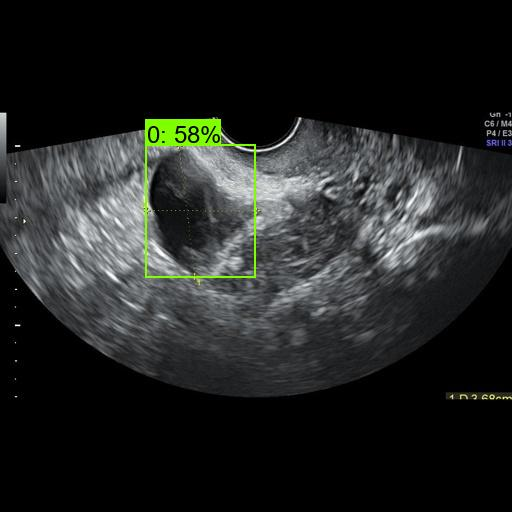

<h2>
EfficientDet-Augmented-Ovarian-UltraSound-Images (Updated: 2023/04/20)
</h2>
This is an experimental project to detect <b>Ovarian-Tumor</b> based on 
Ovrian Ultrasound Images Dataset (OTUI), by using Google Brain AutoML
<a href="https://github.com/google/automl/tree/master/efficientdet"> EfficientDet.</a> 
The original dataset used here has been take from the followin web site: 
<b>Multi-Modality Ovarian Tumor Ultrasound (MMOTU) image dataset</b> 
<pre>
https://github.com/cv516buaa/mmotu_ds2net
</pre>
Citation: 
<pre>
Al-Dhabyani W, Gomaa M, Khaled H, Fahmy A. 
Dataset of breast ultrasound images. Data in Brief. 
2020 Feb;28:104863. 
DOI: 10.1016/j.dib.2019.104863.
</pre>
<pre>
@article{DBLP:journals/corr/abs-2207-06799,
  author    = {Qi Zhao and
               Shuchang Lyu and
               Wenpei Bai and
               Linghan Cai and
               Binghao Liu and
               Meijing Wu and
               Xiubo Sang and
               Min Yang and
               Lijiang Chen},
  title     = {A Multi-Modality Ovarian Tumor Ultrasound Image Dataset for Unsupervised
               Cross-Domain Semantic Segmentation},
  journal   = {CoRR},
  volume    = {abs/2207.06799},
  year      = {2022},
}
</pre>

<b>See also:</b>

A Multi-Modality Ovarian Tumor Ultrasound
Image Dataset for Unsupervised Cross-Domain
Semantic Segmentation

<pre>
https://arxiv.org/pdf/2207.06799v3.pdf
</pre>

<h2>
1. Installing tensorflow on Windows11
</h2>
We use Python 3.8.10 to run tensoflow 2.11.1 on Windows11. 
<h3>1.1 Install Microsoft Visual Studio Community</h3>
Please install <a href="https://visualstudio.microsoft.com/ja/vs/community/">Microsoft Visual Studio Community</a>, 
which can be ITed to compile source code of 
<a href="https://github.com/cocodataset/cocoapi">cocoapi</a> for PythonAPI. 
<h3>1.2 Create a python virtualenv </h3>
Please run the following command to create a python virtualenv of name <b>py38-efficientdet</b>.
<pre>
>cd c:\
>python38\python.exe -m venv py38-efficientdet
>cd c:\py38-efficientdet
>./scripts/activate
</pre>
<h3>1.3 Create a working folder </h3>
Please create a working folder "c:\google" for your repository, and install the python packages. 

<pre>
>mkdir c:\google
>cd    c:\google
>pip install cython
>git clone https://github.com/cocodataset/cocoapi
>cd cocoapi/PythonAPI
</pre>
You have to modify extra_compiler_args in setup.py in the following way:
<pre>
   extra_compile_args=[]
</pre>
<pre>
>python setup.py build_ext install
</pre>

 
<h2>
2. Install EfficientDet-Augmented-Ovarian-UltraSound-Images
</h2>
<h3>2.1 Clone repository</h3>
Please clone EfficientDet-Augmented-Ovarian-UltraSound-Images.git in the working folder <b>c:\google</b>. 
<pre>
>git clone https://github.com/sarah-antillia/EfficientDet-Augmented-Ovarian-UltraSound-Images.git 
</pre>
You can see the following folder <b>projects</b> in EfficientDet-Breast-Cancer of the working folder. 

<pre>
EfficientDet-Augmented-Ovarian-UltraSound-Images
└─projects
      └─OTUSI
          ├─eval
          ├─saved_model
          ├─test
          ├─test_outputs
          ├─train
          └─valid
</pre>
<h3>2.2 Install python packages</h3>

Please run the following command to install python packages for this project. 
<pre>
>cd ./EfficientDet-Augmented-Ovarian-UltraSound-Images
>pip install -r requirements.txt
</pre>

 
<h3>2.3 Create TFRecord dataset</h3>
<h3>
1. Create YOLO annotation
</h3>

 Please download <b>OTU_2d</b> from <a href="https://drive.google.com/drive/folders/1c5n0fVKrM9-SZE1kacTXPt1pt844iAs1?usp=sharing">here</a>
  of Google Drive.
 It contains the following eight categorized Ovarian Tumor Ultrasound Images,images and annotations(mask_images). 
<pre>
"Chocolate cyst"        = 0
"Serous cystadenoma"    = 1
"Teratoma"              = 2
"Theca cell tumor"      = 3
"Symple cyst"           = 4
"Normal ovary"          = 5
"Mucinous cystadenoma"  = 6
"High grade serous"     = 7
</pre>

 We have created OTUSI <b>YOLO</b> annotation dataset from the original <b>OTU_2d</b> dataset by using the following 
 two Python scripts. 
<a href="./projects/OTUSI/create_augmented_master_512x512.py">create_augmented_master_512x512.py</a> 
<a href="./projects/OTUSI/create_yolo_annotation_from_augmented_master.py">create_yolo_annotation_from_augmented_master.py</a> 
<pre>
./YOLO/
├─test/
├─train/
└─valid/
</pre>

<h3>
2. Convert YOLO to TFRecord
</h3>
 We have created <b>TFRecord</b> dataset from OTUSI <b>YOLO</b> train and valid dataset by using 
 <a href="https://github.com/sarah-antillia/AnnotationConverters/blob/main/YOLO2TFRecordConverter.py"> YOLO2TFRecordConverter.py </a>.
 
Futhermore, we have also created <b>COCO</b> dataset from <b>YOLO</b> test dataset by using
 <a href="https://github.com/sarah-antillia/AnnotationConverters/blob/main/YOLO2COCOConverter.py">YOLO2COCOConvert.py</a>
 

If you would like to retrain Ovarian-Tumor EfficientDet Model, please download the <b>TFRecord-OTUSI-20230420.zip</b>
from <a href="https://drive.google.com/file/d/1OqG-aB7FfB0dZkKB0aTMmwcWsStNTsSu/view?usp=sharing"><b>here</b></a>

You can also download  <b>COCO-OTUSI-20230420.zip</b> from 
<a href="https://drive.google.com/file/d/10SOdyMIgX77fRbXIHN-WWWZESmbUYmER/view?usp=sharing"><b>here</b></a>.
 
<h3>2.4 Workarounds for Windows</h3>
As you know or may not know, the efficientdet scripts of training a model and creating a saved_model do not 
run well on Windows environment in case of tensorflow 2.8.0 (probably after the version 2.5.0) as shown below:. 
<pre>
INFO:tensorflow:Saving checkpoints for 0 into ./models\model.ckpt.
I0609 06:22:50.961521  3404 basic_session_run_hooks.py:634] Saving checkpoints for 0 into ./models\model.ckpt.
2022-06-09 06:22:52.780440: W tensorflow/core/framework/op_kernel.cc:1745] OP_REQUIRES failed at save_restore_v2_ops.cc:110 :
 NOT_FOUND: Failed to create a NewWriteableFile: ./models\model.ckpt-0_temp\part-00000-of-00001.data-00000-of-00001.tempstate8184773265919876648 :
</pre>

The real problem seems to happen in the original <b> save_restore_v2_ops.cc</b>. The simple workarounds to the issues are 
to modify the following tensorflow/python scripts in your virutalenv folder. 
<pre>
c:\py38-efficientdet\Lib\site-packages\tensorflow\python\training
 +- basic_session_run_hooks.py
 
634    logging.info("Saving checkpoints for %d into %s.", step, self._save_path)
635    &#035;&#035;&#035; workaround date="2022/06/18" os="Windows"
636    import platform
637    if platform.system() == "Windows":
638      self._save_path = self._save_path.replace("/", "\\")
639    &#035;&#035;&#035;&#035; workaround
</pre>

<pre>
c:\py38-efficientdet\Lib\site-packages\tensorflow\python\saved_model
 +- builder_impl.py

595    variables_path = saved_model_utils.get_variables_path(self._export_dir)
596    &#035;&#035;&#035; workaround date="2022/06/18" os="Windows" 
597    import platform
598    if platform.system() == "Windows":
599      variables_path = variables_path.replace("/", "\\")
600    &#035;&#035;&#035; workaround
</pre>
 
<h3>3. Inspect tfrecord</h3>
  Move to ./projects/IT_RoadSigns directory, and run the following bat file: 
<pre>
tfrecord_inspect.bat
</pre>
, which is the following:
<pre>
python ../../TFRecordInspector.py ^
  ./train/*.tfrecord ^
  ./label_map.pbtxt ^
  ./Inspector/train
</pre>
 
This will generate annotated images with bboxes and labels from the tfrecord, and cout the number of annotated objects in it. 
 
<b>TFRecordInspecotr: annotated images in train.tfrecord</b> 

 
 
<b>TFRecordInspecotr: objects_count train.tfrecord</b> 

 
This bar graph shows that the number of the objects contained in train.tfrecord.
 
 
 
<h3>4. Downloading the pretrained-model efficientdet-d0</h3>
Please download an EfficientDet model chekcpoint file <b>efficientdet-d0.tar.gz</b>, and expand it in <b>EfficientDet-IT-RoadSigns</b> folder. 
 
https://storage.googleapis.com/cloud-tpu-checkpoints/efficientdet/coco2/efficientdet-d0.tar.gz
 
See: https://github.com/google/automl/tree/master/efficientdet 

<h3>5. Training Breast-Cancer Model by using the pretrained-model</h3>

Please change your current directory to <b>./projects/OTUSI</b>,
and run the following bat file to train Ovarian-Tumor EfficientDet Model by using the train and valid tfrecords.
<pre>
1_train.bat
</pre>

<pre>
rem 1_train.bat
rem 2023/04/20
python ../../ModelTrainer.py ^
  --mode=train_and_eval ^
  --train_file_pattern=./train/*.tfrecord  ^
  --val_file_pattern=./valid/*.tfrecord ^
  --model_name=efficientdet-d0 ^
  --hparams="learning_rate=0.1,image_size=512x512,num_classes=8,label_map=./label_map.yaml" ^
  --model_dir=./models ^
  --label_map_pbtxt=./label_map.pbtxt ^
  --eval_dir=./eval ^
  --ckpt=../../efficientdet-d0  ^
  --train_batch_size=4 ^
  --early_stopping=map ^
  --patience=10 ^
  --eval_batch_size=4 ^
  --eval_samples=300  ^
  --num_examples_per_epoch=1200 ^
  --num_epochs=100
</pre>

<table style="border: 1px solid &#035;000;">
<tr>
<td>
--mode</td><td>train_and_eval</td>
</tr>
<tr>
<td>
--train_file_pattern</td><td>./train/*.tfrecord</td>
</tr>
<tr>
<td>
--val_file_pattern</td><td>./valid/*.tfrecord</td>
</tr>
<tr>
<td>
--model_name</td><td>efficientdet-d0</td>
</tr>
<tr><td>
--hparams</td><td>"learning_rate=0.1,image_size=512x512,num_classes=8,label_map=./label_map.yaml"
</td></tr>
<tr>
<td>
--model_dir</td><td>./models</td>
</tr>
<tr><td>
--label_map_pbtxt</td><td>./label_map.pbtxt
</td></tr>

<tr><td>
--eval_dir</td><td>./eval
</td></tr>

<tr>
<td>
--ckpt</td><td>../../efficientdet-d0</td>
</tr>
<tr>
<td>
--train_batch_size</td><td>4</td>
</tr>
<tr>
<td>
--early_stopping</td><td>map</td>
</tr>
<tr>
<td>
--patience</td><td>10</td>
</tr>

<tr>
<td>
--eval_batch_size</td><td>1</td>
</tr>
<tr>
<td>
--eval_samples</td><td>200</td>
</tr>
<tr>
<td>
--num_examples_per_epoch</td><td>1200</td>
</tr>
<tr>
<td>
--num_epochs</td><td>100</td>
</tr>
</table>
 
 
<b>label_map.yaml:</b>
<pre>
1: '0'
2: '1'
3: '2'
4: '3'
5: '4'
6: '5'
7: '6'
8: '7'
</pre>
The console output from the training process is the following, from which you can see that 
<b>Average Precision [IoU=0.50:0.95]</b> is very low. 
 
<b><a href="./projects/OTUSI/eval/coco_metrics.csv">COCO metrics at epoch 54</a></b> 

 

 
<b><a href="./projects/OTUSI/eval/coco_metrics.csv">COCO metrics f and map</a></b> 

 
 
<b><a href="./projects/OTUSI/eval/train_losses.csv">Train losses</a></b> 

 
 

<b><a href="./projects/OTUSI/eval/coco_ap_per_class.csv">COCO ap per class</a></b> 

 

<h3>
6. Create a saved_model from the checkpoint
</h3>
  Please run the following bat file to create a saved_model from the checkpoint files in <b>./models</b> folder.  
<pre>
2_create_saved_model.bat
</pre>
, which is the following:
<pre>
rem 2_create_saved_model.bat  
python ../../SavedModelCreator.py ^
  --runmode=saved_model ^
  --model_name=efficientdet-d0 ^
  --ckpt_path=./models  ^
  --hparams="image_size=512x512,num_classes=8" ^
  --saved_model_dir=./saved_model
</pre>

<table style="border: 1px solid &#035;000;">
<tr>
<td>--runmode</td><td>saved_model</td>
</tr>

<tr>
<td>--model_name </td><td>efficientdet-d0 </td>
</tr>

<tr>
<td>--ckpt_path</td><td>./models</td>
</tr>

<tr>
<td>--hparams</td><td>"image_size=512x512,num_classes=8"</td>
</tr>

<tr>
<td>--saved_model_dir</td><td>./saved_model</td>
</tr>
</table>

 
 
<h3>
7. Inference Breast-Cancer by using the saved_model
</h3>
<h3>7.1 Inference scripts</h3>
 Please run the following bat file to infer Breast Cancer mages of test dataset:
<pre>
3_inference.bat
</pre>
, which is the following:
<pre>
rem 3_inference.bat
python ../../SavedModelInferencer.py ^
  --runmode=saved_model_infer ^
  --model_name=efficientdet-d0 ^
  --saved_model_dir=./saved_model ^
  --min_score_thresh=0.4 ^
  --hparams="num_classes=8,label_map=./label_map.yaml" ^
  --input_image=./test/*.jpg ^
  --classes_file=./classes.txt ^
  --ground_truth_json=./test/annotation.json ^
  --output_image_dir=./test_outputs
</pre>

<table style="border: 1px solid &#035;000;">
<tr>
<td>--runmode</td><td>saved_model_infer </td>
</tr>
<tr>
<td>--model_name</td><td>efficientdet-d0 </td>
</tr>

<tr>
<td>--saved_model_dir</td><td>./saved_model </td>
</tr>

<tr>
<td>--min_score_thresh</td><td>0.4 </td>
</tr>

<tr>
<td>--hparams</td><td>"num_classes=8,label_map=./label_map.yaml"</td>
</tr>

<tr>
<td>--input_image</td><td>./test/*.jpg</td>
</tr>

<tr>
<td>--classes_file</td><td>./classes.txt</td>
</tr>

<tr>
<td>--ground_truth_json</td><td>./test/annotation.json</td>
</tr>

<tr>
<td>--output_image_dir</td><td>./test_outputs</td>
</tr>
</table>

 

 
<h3>

7.2. Some Inference results of Ovarian-Tumor
</h3>
 
<a href="./projects/OTUSI/test_outputs/rotated-0--1.jpg_objects.csv">rotated-0--1.jpg_objects.csv</a> 
 

 
<a href="./projects/OTUSI/test_outputs/rotated-0--22.jpg_objects.csv">rotated-0--22.jpg_objects.csv</a> 
 

 
<a href="./projects/OTUSI/test_outputs/rotated-0--51.jpg_objects.csv">rotated-0--51.jpg_objects.csv</a> 
 

 
<a href="./projects/OTUSI/test_outputs/rotated-0--101.jpg_objects.csv">rotated-0--101.jpg_objects.csv</a> 
 

 
<a href="./projects/OTUSI/test_outputs/rotated-0--166.jpg_objects.csv">rotated-0--166.jpg_objects.csv</a> 
 

 
<a href="./projects/OTUSI/test_outputs/rotated-0--238.jpg_objects.csv">rotated-0--238.jpg_objects.csv</a> 
 

 
<a href="./projects/OTUSI/test_outputs/rotated-0--311.jpg_objects.csv">rotated-0--311.jpg_objects.csv</a> 
 

 
<a href="./projects/OTUSI/test_outputs/rotated-0--365.jpg_objects.csv">rotated-0--365.jpg_objects.csv</a> 
 

 
<a href="./projects/OTUSI/test_outputs/rotated-0--401.jpg_objects.csv">rotated-0--401.jpg_objects.csv</a> 
 

 
<a href="./projects/OTUSI/test_outputs/rotated-0--542.jpg_objects.csv">rotated-0--542.jpg_objects.csv</a> 
 

<h3>7.3. COCO metrics of inference result</h3>
The 3_inference.bat computes also the COCO metrics(f, map, mar) to the <b>realistic_test_dataset</b> as shown below: 
<a href="./projects/OTUSI/test_outputs/prediction_f_map_mar.csv">prediction_f_map_mar.csv</a>

 
<b><a href="./projects/OTUSI/eval/coco_metrics.csv">COCO metrics at epoch 54</a></b> 

 

From the picture above, you can see that <b>Average Precision @[IoU=0.50:0.05]</b> is very low.

 
<h3>
References
</h3>

<b>1. Multi-Modality Ovarian Tumor Ultrasound (MMOTU) image dataset</b> 
<pre>
https://github.com/cv516buaa/mmotu_ds2net
</pre>
Citation: 
<pre>
Al-Dhabyani W, Gomaa M, Khaled H, Fahmy A. 
Dataset of breast ultrasound images. Data in Brief. 
2020 Feb;28:104863. 
DOI: 10.1016/j.dib.2019.104863.
</pre>
<pre>
@article{DBLP:journals/corr/abs-2207-06799,
  author    = {Qi Zhao and
               Shuchang Lyu and
               Wenpei Bai and
               Linghan Cai and
               Binghao Liu and
               Meijing Wu and
               Xiubo Sang and
               Min Yang and
               Lijiang Chen},
  title     = {A Multi-Modality Ovarian Tumor Ultrasound Image Dataset for Unsupervised
               Cross-Domain Semantic Segmentation},
  journal   = {CoRR},
  volume    = {abs/2207.06799},
  year      = {2022},
}
</pre>

<b>2. A Multi-Modality Ovarian Tumor Ultrasound Image Dataset for Unsupervised Cross-Domain Semantic Segmentation</b> 
Qi Zhao*, Member, IEEE, Shuchang Lyu*, Graduate Student Member, IEEE, Wenpei Bai*, Linghan Cai*, 
Binghao Liu, Meijing Wu, Xiubo Sang, Min Yang, Lijiang Chen, Member, IEEE 
 
<pre>
https://arxiv.org/pdf/2207.06799v3.pdf
</pre>

